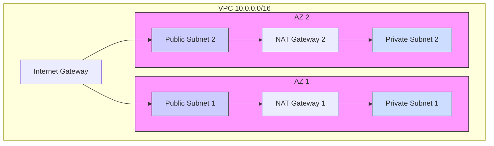
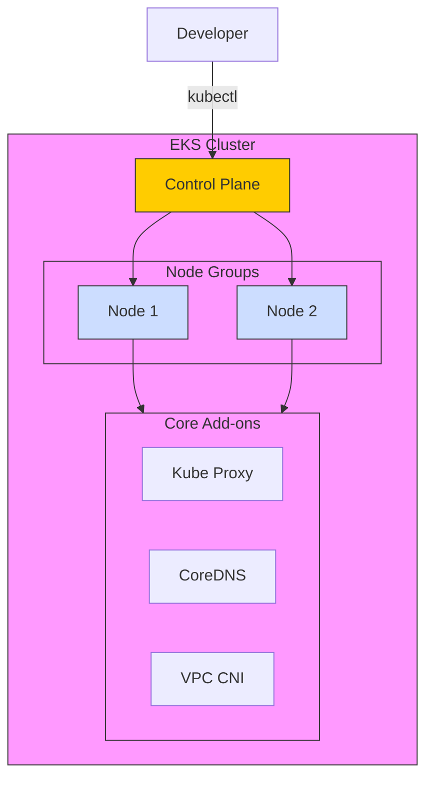
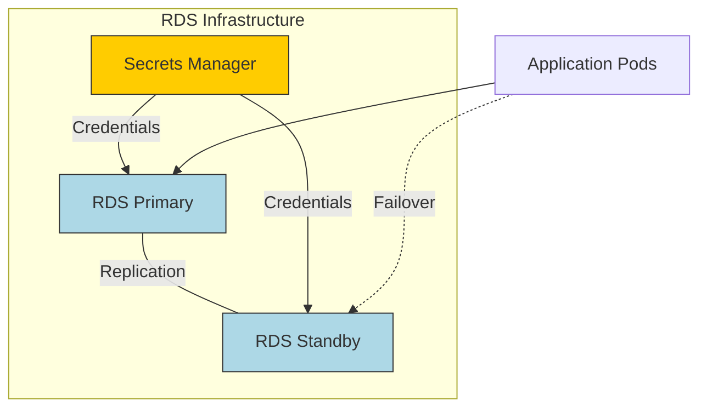
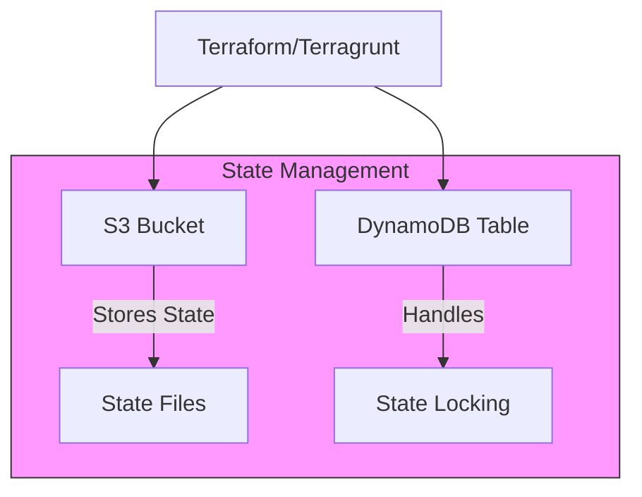

# Infrastructure Architecture

This document breaks down the infrastructure architecture into smaller, more manageable components for better visualization and understanding.

## 1. Network Architecture (VPC)

## 2. EKS Cluster Architecture

## 3. Database Layer

## 4. State Management

Each environment (dev, staging, prod) follows this architecture pattern but with different configurations and resource sizes appropriate for their purpose.
